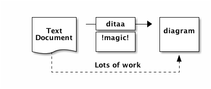

= ditaa 學習筆記

不知道為什麼，對 https://en.wikipedia.org/wiki/Plain_text[純文字 (plain text)] 特別著迷，寫文件用 http://www.methods.co.nz/asciidoc/[AsciiDoc] 或 http://daringfireball.net/projects/markdown/[Markdown]，畫 UML 用 http://plantuml.com/[PlantUML] (或 http://www.umlet.com/[UMLet])，製作圖表 (diagram) 當然也不能例外。

或許你也曾在程式碼註解或技術文件裡看過用符號拼湊出來的圖表，就像下面這樣，是不是非常的精美 :P

----
    +--------+   +-------+    +-------+
    |        | --+ ditaa +--> |       |
    |  Text  |   +-------+    |diagram|
    |Document|   |!magic!|    |       |
    |     {d}|   |       |    |       |
    +---+----+   +-------+    +-------+
        :                         ^
        |       Lots of work      |
        +-------------------------+
----

更多的例子可以在 RFC 文件找到 (像是 https://www.ietf.org/rfc/rfc0007.txt[RFC 0007]、 https://www.ietf.org/rfc/rfc2401.txt[RFC 2401] 等)。雖然各家的畫風不太一樣，但共通點是用幾個簡單的符號，就能將複雜的概念具象化。

這樣做的好處是，從原始的文件就能直接閱讀圖表，若有需要產生更精美的版本，再交給其他工具處理即可。沒錯，這本書的主角 ditaa 可以將 https://en.wikipedia.org/wiki/ASCII_art[文字圖 (ASCII Art)] 轉換成圖檔。

以上面的例子而言，ditaa 可以產生下面的圖形：

心動了嗎？

