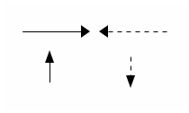
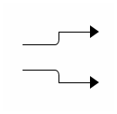
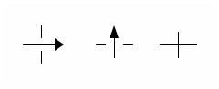

= 線條

水平線跟垂直線分別用 `-` 跟 `|` 表示，箭頭則用 `< > ^ v` (或大寫 `V`)。

----
-------> <------=

   ^        |
   |        :
   |        v
----

輸出結果：

== 轉折

線條的轉折處，直角用 `+`，圓角則用 `/` 或 `\`。

----
    +--->
----/

----\
    +--->
----

輸出結果：

NOTE: ditaa 目前仍不支援斜線，`/` 跟 `\` 雖然可以用來表現圓角。

== 交錯 ==

----
  |       ^      |
---->   --|--  --+--
  |       |      |
----

輸出結果：

