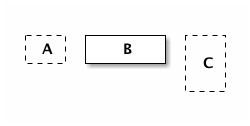
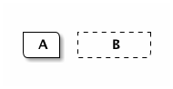
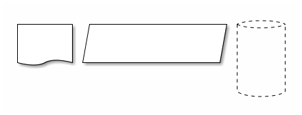
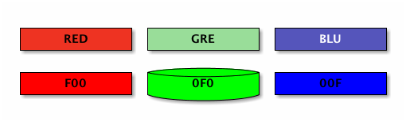
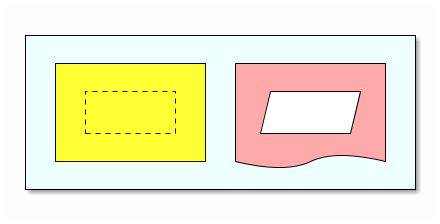
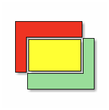
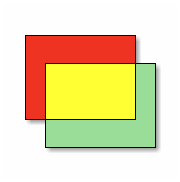

= 形狀與填色

== 矩形

先從最基本的矩形開始。用 `-` 跟 `|` 做為矩形的邊 (虛線一樣用 `=` 或 `:` 標示)，轉角則用 `+`。

----
+=--+ +-------+ +---+
| A | |   B   | :   |
+---+ +-------+ | C |
                |   |
                +---+
----

輸出結果：

虛線沒有陰影效果。

TIP: 在垂直線用 `:` 來標示虛線，會比在水平線用 `=` 標示來得直覺。

== 圓角

轉角處也可以用 `/` 或 `\`，就會變成有質感的圓角。

----
+---\ +-------+
| A | |   B   :
\---+ +-------/
----

輸出結果：

TIP: 若想將所有的轉角 (包括線條的轉折處) 畫成圓角，可以加上 `-r` (`--round-corners`)。

== 其他形狀

嚴格來說，矩形是 ditaa 唯一支援的形狀，其他都是它的變化形，因為其他形狀都不是直接畫出來的，而是在矩形裡加註 tag (成對的 `{ ... }`)，輸出時就會變成不同的形狀 (或符號)。目前支援三種 tag：

 * `{d}` - 文件 (document)
 * `{s}` - 儲存 (storage)
 * `{io}` - 輸出／輸入 (Input/Output)

例如：

----
+-------+ +-------------------+ +------+
|       | |                   | :      |
|       | |       {io}        | |      |
|    {d}| |                   | |      |
+-------+ +-------------------+ |      |
                                |      |
                                |   {s}|
                                +------+
----

輸出結果：

Tag 只要在矩形裡即可，擺放的位置沒有限定 (習慣上會放角落)。另外，矩形搭配 tag 使用時，本身的大小 (dimension) 決定了最後輸出圖形的大小、長寬比例。

== 填色

形狀的內部可以填色，在矩形內部加註色碼 (color code) 即可，也可以跟 tag 混用。色碼的表示法有兩種：

 * `c<CODE>` - 其中 _CODE_ 是三位數的色碼，由左至右分別用 16 進位數字 (`0` ~ `F`) 對應 RGB 三原色，例如 `cF00` (紅色)，`cFF0` (黃色)。
+
--
也就是 https://www.w3.org/TR/css3-color/#rgb-color[CSS 3 三碼顏色表示法]，`#ABC` 等同於 `#AABBCC`。

網路上有許多查詢色碼的網站，雖然多數只提供六碼表示法，但通常取其 2、4、6 碼就會是三碼表示法中相近的顏色，例如 `#3498DB` (水藍色) 可以轉換成 `#39D`，在 ditaa 裡就用 `c39D`。 
--
+
 * `c<NAME>` - 其中 _NAME_ 是三個字母的顏色名稱 (縮寫)，相對容易記憶，有 `GRE` (綠色)、`BLU` (藍色)、`PNK` (粉紅色)、`RED` (紅色)、`YEL` (黃色)、`BLK` (黑色) 6 種顏色可以用。

NOTE: 色碼除了開頭的 `c` 是小寫，後面的三碼都要是大寫，否則只會被視為一般的文字。

例如：

----
+-------------+ +-------------+ +-------------+
|cRED RED     | |cGRE GRE     | |cBLU BLU     |
+-------------+ +-------------+ +-------------+

+-------------+ +-------------+ +-------------+
|cF00 F00     | |c0F0 0F0  {s}| |c00F 00F     |
+-------------+ +-------------+ +-------------+
----

輸出結果：

上下兩排的顏色不太一樣，是因為 `c<NAME>` 背後所代表是混色，`cRED` 並非絕對的紅 (`#F00`)，`cGRE` 並非絕對的綠 (`#0F0`)。

眼尖的你或許也發現右上角 BLU 的文字顏色跟別人不太一樣，那是因為雖然不能指定文字的顏色，但 ditaa 會自動根據背景色調整文字的顏色 (黑/白)，避免因為背景色相對亮／暗，而導致上面的文字不容易閱讀。

跟 tag 的用法一樣，色碼只要在矩形裡即可，擺放的位置沒有限定 (習慣上會放角落)。

NOTE: 填色只能用在封閉的 (closed) 形狀，所以採用虛線時，色碼不會有作用。

== 層疊

----
+--------------------------------------+
|                                      |
|  +--------------+  +--------------+  |
|  |              |  |              |  |
|  |  +--------+  |  |  +--------+  |  |
|  |  :        |  |  |  |        |  |  |
|  |  |        |  |  |  |    {io}|  |  |
|  |  +--------+  |  |  +--------+  |  |
|  |cYEL          |  |cPNK       {d}|  |
|  +--------------+  +--------------+  |
|cEFF                                  |
+--------------------------------------+
----

輸出結果：

// TBD: 上面 `{io}` 的填色竟然不是粉紅色，而是更下面一層，感覺像是 bug？

== 交錯

圖形交錯時，會切割出不同的形狀，色碼可以作用在外圍的形狀，但 tag 只能在交錯出來的矩形裡。

----
+----------+
|cRED      |
| +--------+-+
| |        | |
| |        | |
| |    cYEL| |
+-+--------+ |
  |      cGRE|
  +----------+
----

輸出結果：

另外帶出 `--no-separation`

