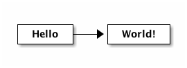
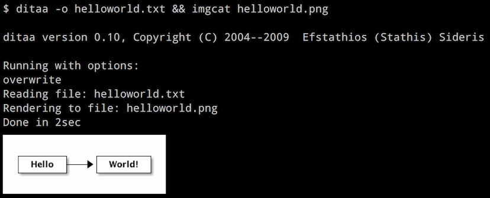

= Hello, World!

學什麼東西都要從 Hello, World! 開始，作圖也不例外 :P

首先用文字編輯器準備一支 `helloworld.txt`，內容如下：

----
+-------+    +--------+
| Hello +--->| World! |
+-------+    +--------+
----

接著交給上一節安裝的 `ditaa` 加工一下：(`ditaa` 指令完整的用法可以參考link:../ditaa-cli.adoc[這裡])

----
$ ditaa helloworld.txt

ditaa version 0.10, Copyright (C) 2004--2009  Efstathios (Stathis) Sideris

Running with options:
Reading file: helloworld.txt
Rendering to file: helloworld.png
Done in 1sec

$ open helloworld.png
----

就會產生下面的圖檔：

`ditaa <INPUT_FILE>` 預設會產生跟 _INPUT_FILE_ 主檔名相同的 PNG 圖檔。

修改文字檔／預覽圖形，在 "用文字作圖" 的過程中會不斷重複，中間要在命令列介面 (CLI) 與圖形介面 (GUI) 間來回切換，其實有點惱人；在 OS X 下如果終端機程式是用 iTerm2，可以直接在 terminal 裡直接預覽產生的圖形。例如：

更多細節可以參考link:../howtos/preview-diagram-in-iterm2.adoc[這裡]。

[TIP]
====
 * http://textik.com/[Textik - ASCII diagrams editor]
 * http://asciiflow.com/[ASCIIFlow Infinity]
====

